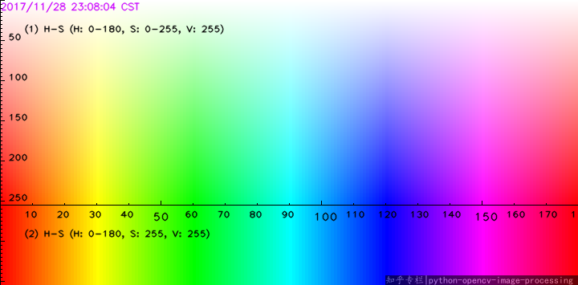

## Solucionador de cubos de Rubik

Proyecto final para **Visión por Computador**

---

# Motivación

> No sé resolver el cubo de Rubik

---

# Motivación

1. Leer sobre algoritmos (CFOP, Lars Petrus, etc.)
2. Seguir tutoriales
3. Desesperación
4. Usar una web que lo resuelva

---

# Motivación


**ROBOTS CAPACES DE RESOLVERLO!**

---

# (Mi) solución

---

## Paso 0: Preprocesado

- Cambio de tamaño
    - Mejor rendimiento
- Corrección de gamma
    - Escenas oscuras


---

## Paso 1: ¿Dónde está el cubo?

---


---


---

| Color | HSV | LAB | YCrCb |
| --- | --- | --- | --- |
| Blanco | V | L | Y |
| Rojo | V | A, B | Cr
| Amarillo | V | L, B | Y, ¬Cb
| Naranja | V | B | Cr, ¬Cb
| Verde | - | ¬A, B | ¬Cr, ¬Cb
| Azul | - | ¬B | Cb

¿`V || ¬Cb || B`?

---


---


---


---

> Se ven bien por separado, pero juntos no

---

## Sistema de votos

Un pixel debe aparecer en N o más máscaras

---

### Problemas
- Demasiado sensible
    - Votación más estricta: Malos resultados
    - Votación menos estricta: Susceptible al ruido
- No se pueden distinguir colores


---

## Otras soluciones

- Binarizar el canal V
    - No siempre funciona

- Binarizar el canal S
    - (tampoco)

- Binarizar ambos y votar
    - No se detecta el blanco (saturación baja)

---

## Solución final

Dividir el canal H en segmentos para cada color



---

### Ventajas
- Más resistente al ruido
- Podemos clasificar colores

---

### Inconvenientes
- Sensible a las condiciones lumínicas
- La diferencia entre dos colores no siempre está clara
    - Rojo
    - Naranja
    - Amarillo

---

# Paso 2: Extraer el cubo

---

## Operaciones morfológicas

1. "Buscar" cuadrados
2. "Cerrar" cuadrados
3. Volver a buscar cuadrados

```py
cv2.morphologyEx(img, cv2.MORPH_OPEN, KERNEL, iterations=N)

cv2.morphologyEx(img, cv2.MORPH_CLOSE, KERNEL, iterations=N)
```

--- 

1. Detección de bordes (laplaciana)
2. Detección de contornos
3. Selección de contornos por área y compacidad

$SquarenessError(s) =  K (\frac{1}{16}-Compactness(s))^2$

---

## Homografía

--- 

## 2 Homografías

---

#### Corrección de perspectiva

1. Recortar el cubo (extraccion de colores)
2. Superponer información (AR)


---

### ¿Por qué no solo una?

Comodidad

---

# Paso 3: Reconocer colores

---

## Primeros intentos

KMeans, Posterización, etc.

Se pierde **demasiada** información

---

## Solución final

Mismo proceso que en el paso de busqueda del cubo

**Rangos en el canal H**

---

# Paso 4: Resolver el cubo

---

1. Extraer los colores de todas las caras
    - Orden: Top, Left, Front, Right, Back, Bottom
2. "Traducir" al formato de la librería
3. Obtener (y optimizar) pasos
4. Superponer con realidad aumentada

---

# ¿Posibles mejoras?

---

# Muchas

---

- Mejor segmentación
    - Resistente a ruido y condiciones lumínicas
- Mejor extracción de colores
- Mejor solución (algoritmos más nuevos)
- Mejor realidad aumentada
- Mejor rendimiento general

---

- Mejor segmentación (!!!)
    - Resistente a ruido y condiciones lumínicas
- Mejor extracción de colores
- Mejor solución (algoritmos más nuevos)
- Mejor realidad aumentada
- Mejor rendimiento general

---

## Si alguien tiene tiempo


(esta hecho con **Lego**!)

---

# Conclusiones

- Los contenidos del temario tienen aplicaciones reales
- Se pueden hacer muchas cosas sin modelos de ML
- El ruido es el enemigo

---

# Contenidos usados
1. Procesamiento de imagenes
2. Suavizado de imagenes
3. Detección de características
4. Segmentación y descripción de regiones
5. Homografías
6. Espacios de color

---

# Herramientas usadas
1. `OpenCV`
2. `Numpy`
3. `Jupyter`
4. `Rerun`
5. `rubik-cube`
6. `Marp`

---

# Muchas gracias